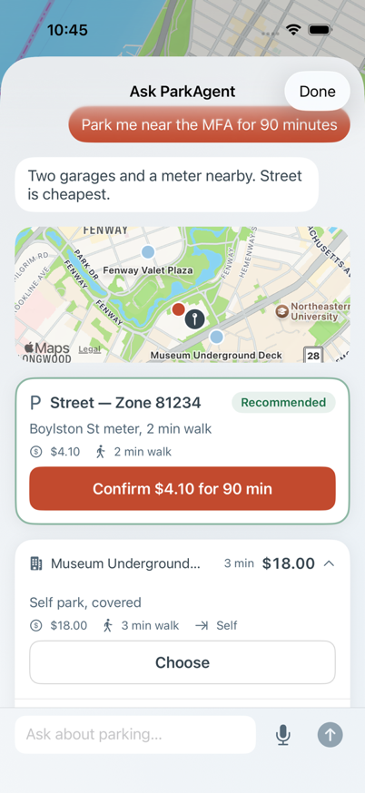
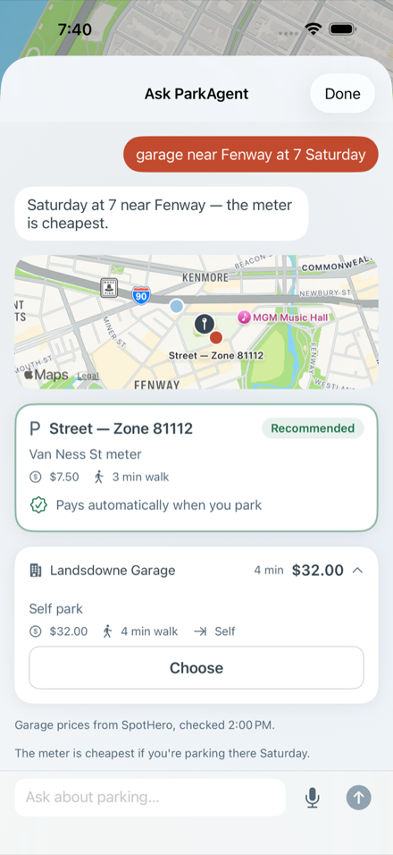
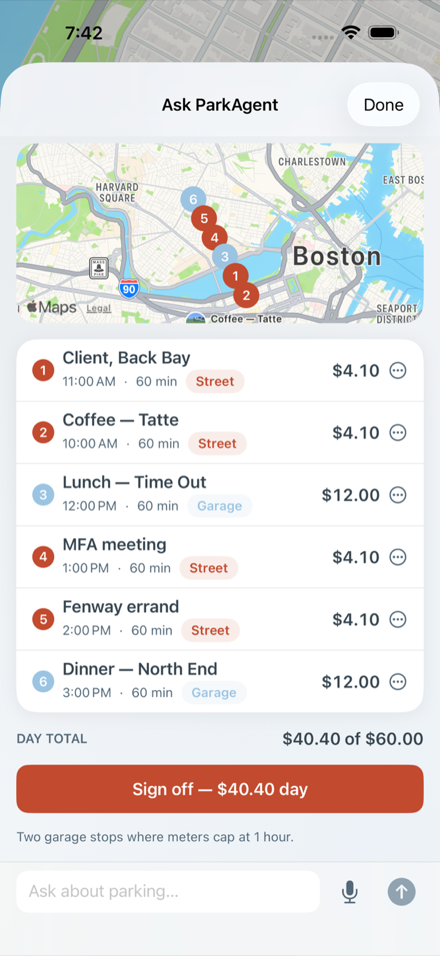

# Assistant grounding verification — live run 2026-09-23

Live verification of the assistant's named-place grounding against
production endpoints (feat/assistant-v2). Method: each place ran through
the REAL `NominatimGeocoder` (city-biased), then a REAL merged garage
search (`makeMultiGarageProvider([SpotHero, ParkWhiz])`) for a
2026-09-24 18:00–22:00 window; distances recomputed from each option's
own coordinates against the geocoded point (haversine). One deep link
per place was then fetched (200 expected, facility name and requested
window must appear in the page). Low volume: one geocode + one search
per provider per place, 1.5 s apart, honest `parkagent-prototype/1.0`
headers.

## Summary

| Place | City | Resolved point | Options | Within 600 m | Deep link check |
|---|---|---|---|---|---|
| Newbury Street | bos | 42.35237, −71.07227 (Back Bay) | 15 | 15/15 | ✅ 200, facility + window render |
| India Street | bos | 42.35879, −71.05377 (Downtown) | 11 | 11/11 | ✅ |
| South Boston | bos | 42.33343, −71.04949 | 7 | 7/7 | ✅ |
| Fenway | bos | 42.34292, −71.09117 (Fenway-Kenmore) | 9 | 9/9 | ✅ |
| TD Garden | bos | 42.36630, −71.06216 (Legends Way) | 11 | 11/11 | ✅ |
| Times Square | nyc | 40.75559, −73.98584 (W 42nd St) | 10 | 10/10 | ✅ |
| Lincoln Center | nyc | 40.77164, −73.98428 (W 62nd St) | 11 | 11/11 | ✅ |

Every place resolved inside the right metro with the city bias
(Boston-biased queries never landed in NYC or Ohio); every surfaced
option sat within 600 m of the resolved point (recomputed, not
provider-claimed); no provider degraded during the sweep.

Sample rows (cheapest/nearest per place, both providers represented):

- Newbury Street — SpotHero \$18.02 · 122 m · "115 Providence St. (350
  Boylston St.)"; ParkWhiz \$21.40 · 208 m · "St. James at Arlington
  Garage"
- India Street — SpotHero \$16.99 · 75 m · "75 State St. - Garage"
- South Boston — SpotHero \$26.77 · 74 m · "212 Dorchester St.";
  ParkWhiz \$26.50 · 241 m · "Marian Manor Building Lot"
- Fenway — SpotHero \$38.06 · 155 m · "67 Symphony Rd."
- TD Garden — SpotHero \$69.71 · 144 m · "TD Garden Official Parking -
  North Station Garage" (event pricing)
- Times Square — SpotHero \$39.22 · 130 m · "113 W 43rd St."; ParkWhiz
  \$42.80 · 166 m · "Icon Parking - Global Parking LLC Garage"
- Lincoln Center — ParkWhiz \$54.64 · 29 m · "(SP+) - 140 W. 62nd St.
  Garage"; SpotHero \$29.68 · 135 m · "161 W 61st St. - Garage"

## What was off, and the fixes

1. **SpotHero deep links opened the area, not the facility.** The old
   link was `spothero.com/search?latitude=…&starts=…` — right place and
   time, wrong granularity (the user still had to find the garage on the
   map). Verified live that
   `spothero.com/checkout/{facility_id}?starts=…&ends=…` returns 200 and
   renders that facility's checkout with the requested window in the
   page state (probed facilities 135220 "115 Providence St." and 97207
   "299 Berkeley St."). The provider now emits the facility checkout
   link per option; `spotheroDeepLink()` (area search) remains only as
   the no-facility fallback.
2. **Distance guard could be fooled by provider-claimed distances.**
   Options now carry the facility's own coordinates
   (`facility.common.addresses[0]` for SpotHero, `entrances[0]` for
   ParkWhiz) and the 600 m guard recomputes haversine from the geocoded
   point. When everything is dropped for distance, the tool reports
   `nearestBeyondM` so the reply says "the nearest is about N m away",
   never "none found".
3. **Geocode bias was a blinder.** A city-biased Nominatim query
   previously searched only that metro's viewbox; "Times Square" from a
   Boston phone would have found nothing. The bias now orders the search
   (biased metro first, the other as fallback) instead of excluding.

4. **SpotHero ignores a window's offset** (found in review,
   2026-09-24). Probed `spothero.com/checkout/135220` with the same 6–10
   PM ET stay written three ways: naive `2026-09-26T18:00:00` and
   `…T18:00:00-04:00` both rendered 18:00, but `…T22:00:00.000Z` (the
   same instant) rendered **22:00** — SpotHero reads the wall-clock
   digits and drops the zone. ParkWhiz's API honors offsets (all three
   forms came back `start_time 18:00:00-04:00`). So SpotHero's search and
   checkout links now get ET wall-clock time, and every model-supplied
   time is normalized server-side (offset-less = ET, never the host's
   zone — UTC on Fly).
5. **The same facility for a new window reused the old link** (found in
   review). Option ids were facility ids, so after "make it 5 instead"
   the cache handed back the 2 PM checkout link for the 5 PM card. Ids
   are now `{provider}-{facility}-{windowTag}`.

## ParkWhiz spike (read-only public search)

Question: can parkwhiz.com's search be read like SpotHero's — no login,
no evasion, low volume, honest headers?

**Yes.** `GET https://api.parkwhiz.com/v4/quotes/?q=coordinates:LAT,LNG
distance:0.5&start_time=…&end_time=…` — the same endpoint their own site
reads — answers **200 unauthenticated** (probed 2026-09-23 from the
Seaport: 24 rows) with plain `Accept: application/json` and a
`parkagent-prototype/1.0` user agent. The partner docs describe an OAuth
surface, but public quote reads don't require it. Notes on the LIVE
shape (differs from the v4 docs in places):

- price: `purchase_options[0].price.USD`, dollars as a string, fees
  included (`base_price` \$29.00 → `price` \$33.93 on the probe row);
- distance: `distance.straight_line.meters` (docs said miles on the
  location);
- coordinates: `_embedded["pw:location"].entrances[0].coordinates`
  (`location.coordinates` was null on live rows);
- checkout: the API hands out its own consumer-site link —
  `purchase_options[0]._links["site:purchase"].href` →
  `parkwhiz.com/find_and_book/?location_id=…&start_time=…&end_time=…`,
  verified 200 with the facility name and window rendered ("Commonwealth
  Pier Garage", location 61989).

So `ParkWhizProvider` was built read-only behind the same
`GarageProvider` interface: facilities, prices, distances, entrance
coordinates, the API's own prefilled checkout deep link, the same typed
errors (`blocked` ≠ `parse_failed` ≠ `network` ≠ empty), 10-minute
cache, ≤8 options. `makeMultiGarageProvider` merges it with SpotHero,
deduping by normalized facility address (cheaper listing wins — e.g. "1
Seaport Lane" ≡ "1 Seaport Ln., Boston"); a provider that fails while
the other answers is reported in `degraded`, and only both-failed is a
search failure. `PARKWHIZ_ENABLED=false` drops back to SpotHero only.
If ParkWhiz ever starts answering 401/403/429, the adapter returns the
typed `blocked` error — that's their call and our stop, not a thing to
work around.

## What it looks like

Captured from the UI-test run (`ParkAgentUITests/AssistantUITests`,
iPhone 17 Pro Max, mock API; refreshed after the 2026-09-24 review):

| | |
|---|---|
|  |  |
| The recommended option as one hero card with the only coral action; alternatives as compact rows, one expanded showing its neutral Choose; the mini map pins the destination (dark) and the options (coral = recommended). | A street option for a future time: "Pays automatically when you park", no button — the detector pays at the curb. The garage alternative is still choosable. |

The day after reordering stop 2 above stop 1: numbered stops on the map,
per-stop cost, day total against the cap, one Sign off.

## Repro

    pnpm -C server verify:garages
    pnpm -C server verify:garages --places "Fenway,Times Square"

`server/src/scripts/verify-garages.ts` drives the same classes prod uses
— the real `NominatimGeocoder` and the real merged garage provider,
nothing mocked — recomputing each option's distance from the facility's
own coordinates and printing the deep links so they can be opened and
checked. Read-only and low volume: one geocode plus one search per
provider per place, spaced for Nominatim's courtesy limit. It defaults
to tomorrow 18:00–22:00 so the window is never in the past.
